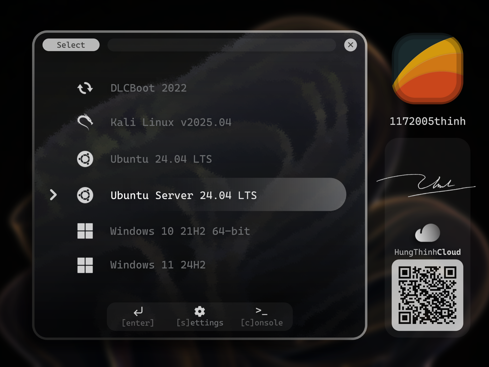

#  AUTOINSTALLER

`AutoInstaller` is a comprehensive automation solution for a **fresh Windows 11 installation** with third-party apps, drivers, and configurations.

---
## **🚨IMPORTANT:** This `main` branch is under a large refactor. It is *not completed* and definitely *not working*, please visit the `dev` branch temporarily for the last stable version. Thank you.

## 📖 TABLE OF CONTENTS

| No. | Section |
|---|---|
| 0 | [Why AutoInstaller](#why-autoinstaller) |
| 1 | [Main Features](#main-features) |
| 2 | [Project Structure](#project-structure) |
| 3 | [Getting Start](#getting-start) |
| 4 | [Incoming Features](#incoming-features) |
| 5 | [Changelog](#changelog) |
| 6 | [Known Issues](#known-issues) |
| 7 | [References](#references) |
| 8 | [License & Disclaimer](#license) |
| 9 | [Contribution](#contribution) |

 

---

## 💡 WHY AUTOINSTALLER?

> **Ever heard of `GHOST`?**

It is an "old school" solution to `clone` a machine to another one. A clone image might have Windows pre-installed, all the applications, drivers, and configurations you need. Easy to deploy, fast to restore, just a USB and you are good to go. However, if you are installing a fresh Windows from an shared image, think about it:

|**Potential Risks**|
|---|
|How about the `hardware configuration` is not the same? The drivers might *not be compatible* with the new machine. Good luck with `BSOD`!|
|Or, you don't like the idea of *sharing a cloned OS* with someone else? How about the `personalization`? How about the `privacy`? How about the `bloatware`? You may not want to share your custom configuration with others.|
|Or, the `corrupted` image that includes a `funny virus/malware`? You might not know *what has been added* in the image.|

***Do you really trust the distributor?***

> **Here comes `AutoInstaller`**

Your machine, *your own personalized Windows*, softwares and configuration in your hand, fully installed with automation scripts.

## ✨ MAIN FEATURES

[AutoInstaller](https://github.com/1172005thinh/AutoInstaller) is a complete automation of fresh Windows installation, this tool provides:

1. **A custom bootable USB drive** with [Ventoy](https://www.ventoy.net/en/index.html) supporting:
    - A custom boot menu theme [1172005thinh](tools/Ventoy/AutoInstaller/theme/1172005thinh):

        | Dark Theme Preview | Light Theme Preview |
        | :---: | :---: |
        |  |  |

    - A custom Ventoy configuration [ventoy.json](tools/Ventoy/AutoInstaller/ventoy.json) with pre-defined `Menu Alias`, `Menu Tips`, `Themes`, `Menu Class`, and `Auto-select` with [unattend scripts](Unattend):
        + **Menu Alias**: Replace the default image name with a custom name.
        + **Menu Tips**: Display a short description of the image.
        + **Themes**: Apply a custom theme to the boot menu with integrated [fonts](tools/Ventoy/AutoInstaller/font/cascadia-code).
        + **Menu Class**: To add [icons](tools/Ventoy/AutoInstaller/theme/1172005thinh/icons) to existing images.
        + **Unattend scripts**: Overall, these unattend scripts provides:
            + Installing Windows hands-off
            + Bypassing Windows 11 Hardware checks (TPM 2.0, Secure Boot, RAM, CPU, etc.)
            + Automatic/Manual disks, partitions selection/creation
            + Setting up Windows with your preferences (language, timezone, keyboard layout, etc.)
            + Creating a local user account
            + Disabling BitLocker
            + Remove bloatwares
            + And a lot more
        + About Ventoy Plugin, please refer to [Ventoy Plugin Docs](https://www.ventoy.net/en/plugin_entry.html) for more information.
2. **🏗️ Underconstruction...**

## 📁 PROJECT STRUCTURE

**🏗️ Underconstruction...**

 

---

## 🚀 GETTING START

**🏗️ Underconstruction...**

### 📋 REQUIREMENTS

**🏗️ Underconstruction...**

### 🛠️ STEP-BY-STEP

**🏗️ Underconstruction...**

### ✅ VERIFICATION

**🏗️ Underconstruction...**

 

---

## 🔮 INCOMING FEATURES

These below are my `ideas`, `not promises`:

|No.|Features|
|---|---|
|0|GUI for customization|
|1|Auto-download setup files/dependencies/third-party tools|
|2|Re-organize project structure|
|3|Add more .au3 mini-installers|

## ⏳ CHANGELOG

**🏗️ Underconstruction...**

## ⚠️ KNOWN ISSUES

**🏗️ Underconstruction...**

## 📚 REFERENCES

|No.|Ref.|
|---|---|
|0|[Unattend Generator Schneegans.de](https://schneegans.de/windows/unattend-generator/)|
|1|[Microsoft Autounattend](https://learn.microsoft.com/en-us/windows-hardware/customize/desktop/unattend/)|
|2|[GRUB2 Theme Icons](https://www.gnome-look.org/p/2206122)|
|3|[Cascadia-Code Fonts](https://fonts.google.com/specimen/Cascadia+Code)|
|4|[AutoIt Scripts](https://www.autoitscript.com/wiki/)|
|5|[Snappy Driver Installer Origin](https://www.snappy-driver-installer.org/)|

## ⚖️ LICENSE

Please refer to [LICENSE.md](LICENSE.md) for more information.

### **🚨 DISCLAIMER & COMPLIANCE STATEMENT**

> **Notice:** The software demonstrated and provided in this repository is completely clean and does not contain, facilitate, or execute any unauthorized activation scripts, crack tools, bypasses, or unlawful modification mechanisms.

1. **Windows Licensing & Activation:**
   - The tool strictly supports standard product key injection for users possessing legitimate, officially purchased volume/retail licenses (e.g., physical product keys from authorized distributors, digital licenses directly purchased from official channels), or automatic detection of genuine OEM digital product keys embedded within system BIOS/firmware.
   - If no valid license key is provided or detected, the operating system remains entirely **unactivated** in its default evaluation state. *Note: Product keys must strictly correspond to their respective Windows editions.*

2. **Microsoft Office Deployment:**
   - Office installation is handled exclusively via the official Microsoft Office Deployment Tool (ODT) using genuine, unaltered sources downloaded directly from Microsoft content delivery networks (CDNs).
   - The tool solely orchestrates deployment according to predetermined XML configuration files—specifying application components (Word, Excel, PowerPoint, Access), language packs (e.g., `vi-vn`, `en-us`), and user-provided volume product keys (or BIOS-detected credentials).
   - In the absence of a user-provided license key, Microsoft Office installs in an **unlicensed** state, awaiting official user activation, Microsoft 365 credential login, or product key entry. *Note: Product keys are strictly valid only for their corresponding software suites.*
   - The tool functions solely as a deployment orchestrator. **Misuse of an unlicensed installation (such as unauthorized commercial usage without a valid Microsoft 365 subscription or failure to procure proper licensing) is strictly outside the scope and responsibility of this tool and its author.**

3. **Third-Party Applications:**
   - All third-party applications deployed by this tool are strictly freeware (e.g., Google Chrome Standalone), open-source software (e.g., LibreOffice, OBS Studio), or products offering an official free tier (e.g., TeamViewer).
   - For proprietary software providing trial evaluation periods (e.g., WinRAR), users are explicitly encouraged to purchase a valid commercial license from the respective vendor.

4. **Open-Source Derivatives & Liability Waiver:**
   - This project is published under the open-source [**MIT License**](https://en.wikipedia.org/wiki/MIT_License).
   - The original author ([1172005thinh](https://github.com/1172005thinh)) assumes **no responsibility or liability** for any third-party forks, redistributions, or modified versions that may inject, modify, or append unauthorized activation scripts, cracks, or malicious payloads.

> **Absolute Prohibition:** This tool does **not** contain, distribute, or promote any illegal cracking methods, KMS emulators, keygens, or license tampering mechanisms under any circumstances or by any means.

> **NOTE**: I am *not a lawyer*. This disclaimer is based on ***`my understanding`*** and ***`translated with AI`***.

## 🤝 CONTRIBUTION

This is a `hobby project`, I am the only developer and I am still in school so I can not promise to update the tools regularly. It is my own decision to maintain or discontinue this project at any time.

**Author: `1172005thinh`** 

- `Hung Thinh Nguyen` [GitHub](https://github.com/1172005thinh)
- `Nguyễn Hưng Thịnh` [Facebook](https://www.facebook.com/quickcomp.hungthinhnguyen)
- `HungThinhCloud` [Public Profile](https://hungthinhcloud.freeddns.org/about/)

**Contributors: `AI Agents`**

- `Claude - Anthropic` - Master reasoning
- `Codex - OpenAI` - Coder
- `Gemini - Google` - Researching and validation testing
